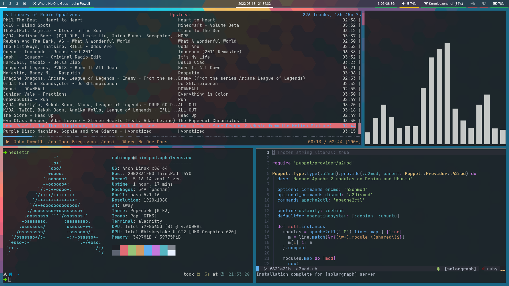

# Dotfiles

[]

## Disclaimer

Writing code is hard. So instead, I ~~steal~~ ~~copy/paste~~ borrow from excellent external sources.

90% of what you see here can be accredited to these two wonderful fellas:
  
  * [Vince Verpaelst](https://github.com/VinceVrp/)
  * [Dieter Maes](https://github.com/dmaes/)

## About

This repository is a reflection of the configuration files I'm using with my Arch based workstation. 

## Programs used

### Window Manager, desktop environment and related tools

|     |     |
| --- | --- |
| [Sway](https://github.com/swaywm/sway) | Wayland-based tiling window manager |
| [Kanshi](https://github.com/emersion/kanshi) | Display-management-as-code |
| [Waybar](https://github.com/Alexays/Waybar)| Wayland-based window bar |
| [Swaylock-effects](https://github.com/mortie/swaylock-effects) | Wayland screen locker |
| [Grimshot](https://github.com/swaywm/sway/blob/master/contrib/grimshot) | Wayland screenshot utility |
| [Rofi](https://github.com/davatorium/rofi) | Menu launcher |

### Terminal

|     |     |
| --- | --- |
| [Alacritty](https://github.com/alacritty/alacritty) | Terminal emulator |
| [ZSH](https://github.com/zsh-users/zsh) | Shell |
| [Oh-my-zsh](https://github.com/ohmyzsh/ohmyzsh) | ZSH plugin manager |
| [Powerlevel10k](https://github.com/romkatv/powerlevel10k) | ZSH Theme |
| [fzf](https://github.com/junegunn/fzf) | fuzzy finder |
| [lf](https://github.com/gokcehan/lf) | terminal filebrowser |
| [pistol](https://github.com/doronbehar/pistol) | Previewer with syntax highlighting for lf |
| [zoxide](https://github.com/ajeetdsouza/zoxide) | A smarter cd command |

### Colors, fonts, themes, etc.

|     |     |
| --- | --- |
| [JetBrainsMono Nerd Font](https://github.com/ryanoasis/nerd-fonts) | Patched JetBrains fonts with glyphs |
| [Arc-Dark-Solid](https://github.com/jnsh/arc-theme) | GTK theme |
| [Paper](https://github.com/snwh/paper-icon-theme) | Icons |

### Text editor and other tools

|     |     |
| --- | --- |
| [Lunarvim](https://github.com/LunarVim/LunarVim) | An opionated IDE layer for Neovim with sane defaults |
| [ncspot](https://github.com/hrkfdn/ncspot) | Spotify ncurses client, written in Rust |

## License

[MIT](LICENSE)
